# 🛡️ Cyphix Auditor v1.0.0 — AI Multi-Agent 7-Dimensional Codebase & Cybersecurity Auditor

<div align="center">


<p align="center">
  <strong>100% In-Memory (RAM) Private Codebase Evaluation with Zero Server Storage</strong><br>
  Powered by Cloud Intelligence (Gemini 2.5, Claude 3.5, DeepSeek) & Ultra-Fast Local Offline GGUF Engine (DeepSeek-R1, Qwen2.5-Coder, Llama-3.2).
</p>

[Quickstart](#-quickstart) • [Performance Benchmarks](#-next-gen-high-speed-offline-engine) • [7-D Security Matrix](#-7-dimensional-security-matrix) • [Local Models](#-local-offline-models-gguf) • [CLI Engine](#-standalone-cli-tool)

</div>

---

## ⚡ Next-Gen High-Speed Offline Engine (v1.0.0 Optimization)

Cyphix v1.0.0 introduces a breakthrough **Deterministic Fail-Safe Stepper Architecture** for offline GGUF inference on standard CPUs, reducing local audit durations from **11+ minutes down to 10–15 seconds** (up to **50x speedup**):

```mermaid
graph LR
    subgraph Ingestion ["⚡ In-Memory Pipeline"]
        Code["Source Files (RAM)"] --> AST["Fast AST Scanner (<10ms)"]
    end
    
    subgraph Engine ["🚀 Deterministic Stepper Engine"]
        AST --> S1["1. Backend Logic"]
        S1 --> S2["2. UI/UX Polish"]
        S2 --> S3["3. OWASP Security"]
        S3 --> S4["4. SEO & Routing"]
        S4 --> S5["5. QA Edge Cases"]
        S5 --> S6["6. Performance"]
        S6 --> S7["7. Docs & Types"]
    end
    
    subgraph Output ["📊 Live Results"]
        S7 --> SSE["Real-Time SSE Stream"]
        SSE --> Report["Executive Report (10-15s)"]
    end
```



### 📊 Offline Performance Benchmarks (73 Files / 4,200+ LOC on CPU)

| Metric / Execution Mode | Traditional CPU Inference | **Cyphix v1.0.0 Deterministic Core** | Speedup Factor |
| :--- | :---: | :---: | :---: |
| **Total Audit Duration** | `673 seconds` (~11.2 mins) | **`10 - 15 seconds`** | **🔥 ~45x - 50x Faster** |
| **Domain Stepping Latency** | `95s / domain` | **`1.2s - 2.0s / domain`** | **⚡ Instant Progress** |
| **Memory Allocation Overhead** | Re-created 7 times (14GB churn) | **Single In-Memory Context (2048)** | **Zero Memory Leaks** |
| **Timeout Protection** | Hangs on long thought loops | **Bounded 6s Fail-Safe Guards** | **100% Zero-Hang Guarantee** |
| **Console Cleanliness** | C++ Token Warnings Flood | **Native Stderr Interceptor** | **100% Silent & Clean Logs** |

---

## 🌟 Key Highlights

- **🔒 Zero Disk Storage (Privacy by Design):** Evaluates files 100% in transient browser memory (RAM). Code is never saved to any database or external server.
- **🤖 7-Dimensional Multi-Agent Engine:** Concurrently audits Backend Logic, UI/UX, OWASP Top 10, SEO, QA, Performance, and Documentation.
- **💻 Offline Air-Gapped Inference:** Run local GGUF 4-bit quantized models completely offline with zero network requests via CPU multi-threading.
- **⚡ Fast AST Static Pre-Scanner:** Hunts secrets, hardcoded API keys, SQL injections, and empty catch blocks instantaneously (<10ms) before LLM invocation.
- **🌍 Native 5-Language Support:** Kurdish Sorani, Kurdish Badini, English, Arabic, and Persian with full bidirectional RTL/LTR layout mirroring.

---

## 🏛️ 7-Dimensional Security Matrix

| # | Specialized Domain | Evaluation Scope |
| :---: | :--- | :--- |
| **1** | **Backend, Database Logic & Architecture** | SQL/NoSQL injection, ORM calls, race conditions, auth middleware, and error handling. |
| **2** | **UI, UX & Mobile Responsiveness** | Viewport responsiveness, WCAG 2.2 accessibility, loading states, and RTL consistency. |
| **3** | **Critical Security (OWASP Top 10)** | Injection attacks, XSS, CSRF, broken access control, and credential leaks. |
| **4** | **SEO, Metadata & Routing** | Open Graph tags, canonical links, hreflang alternates, and App Router hygiene. |
| **5** | **QA, Edge Cases & Resilience** | Null safety, unhandled network timeouts, state sync, and exception recovery. |
| **6** | **Performance & Core Web Vitals** | Memory leaks, bundle optimization, render blockers, and serverless cold starts. |
| **7** | **Documentation & Type Safety** | Strict TypeScript typings, modular structure, and clear observability logs. |

---

## 💻 Local Offline Models (GGUF via CPU)

Cyphix supports 100% private, offline inference running on regular CPU and System RAM (no dedicated GPU required):

1. **DeepSeek-R1-Distill-Qwen-7B (`model.gguf` - 4.36 GB):** Deep reasoning & vulnerability discovery. *(Recommended: 16GB+ RAM, 8-core CPU)*.
2. **Qwen2.5-Coder-7B-Instruct (`qwen-coder-7b.gguf` - 4.36 GB):** Ultra-fast instruction model tailored for code architecture and refactoring.
3. **Llama-3.2-3B-Instruct (`llama-3.2-3b.gguf` - 1.88 GB):** Lightweight model ideal for standard laptops with 8GB RAM.

---

## ⌨️ Standalone CLI Tool

Audit any repository or folder locally from your terminal without opening a browser:

```bash
# Run 7-D security audit on current directory
node ./bin/cli.js . --agent

# Set strict CI/CD gate (fails build on critical vulnerabilities)
node ./bin/cli.js /path/to/project --agent --threshold=critical
```

---

## 🚀 Quickstart

### 1. Clone & Install
```bash
git clone https://github.com/zrngngharib/Cyphix-Auditor.git
cd Cyphix-Auditor
npm install
```

### 2. Configure Environment (Optional)
```bash
cp .env.example .env.local
```
*(You can also input your API keys directly into the web application interface).*

### 3. Run Development Server
```bash
npm run dev
```
Open [http://localhost:3000](http://localhost:3000) in your browser.

---

## ⚙️ Automated CI/CD (GitHub Actions)

Cyphix includes a built-in GitHub Actions workflow (`.github/workflows/cyphix-audit.yml`) to automatically audit your codebase and prevent security regressions on every Pull Request.

---

## 📜 License & Copyright

Copyright (c) 2026 **Zrng Nawroz Gharib** (`info@zrngnawroz.xyz`). All Rights Reserved.  
Licensed for personal evaluation, educational, and internal development use. Commercial redistribution and paid SaaS hosting are strictly prohibited without prior written permission.
