# 🛡️ Cyphix Auditor v1.0.0 — AI Multi-Agent 7-Dimensional Codebase & Cybersecurity Auditor

<div align="center">


<p align="center">
  <strong>100% In-Memory (RAM) Private Codebase Evaluation with Zero Server Storage</strong><br>
  Powered by Cloud Intelligence (Gemini 2.5, Claude 3.5, DeepSeek) & Ultra-Fast Local Offline GGUF Engine (DeepSeek-R1, Qwen2.5-Coder, Llama-3.2).
</p>

[Quickstart](#-quickstart) • [Language Matrix](#-universal-multi-language--framework-matrix) • [Offline Benchmarks](#-next-gen-high-speed-offline-engine) • [7-D Security Matrix](#-7-dimensional-security-matrix) • [CLI Engine](#-standalone-cli-tool)

</div>

---

## 🌐 Universal Multi-Language & Framework Matrix

Cyphix Auditor is built with a universal multi-language static analysis engine and domain chunking pipeline that seamlessly audits **24 Programming Languages**, **30+ Modern Frameworks**, and **20+ Infrastructure & Configuration Formats**:

### 💻 1. Supported Programming Languages (24 Languages)

| Language | File Extensions | Specialized Security & Audit Scope |
| :--- | :--- | :--- |
| **TypeScript** | `.ts`, `.tsx`, `.mts`, `.cts` | Strict type safety, `any` abuse, Server Actions, async race conditions, React hook dependencies. |
| **JavaScript** | `.js`, `.jsx`, `.mjs`, `.cjs` | Prototype pollution, `eval()`, DOM XSS (`dangerouslySetInnerHTML`), unhandled promise rejections. |
| **Python** | `.py`, `.pyw`, `.pyi` | Insecure deserialization (`pickle.loads`), command injection (`shell=True`), hardcoded Django secrets, SQLi. |
| **PHP** | `.php`, `.phtml`, `.blade.php` | Remote Code Execution (`shell_exec`, `passthru`), PHP object injection (`unserialize`), SQL injection. |
| **Go (Golang)** | `.go` | Race conditions, goroutine leaks, unescaped HTML template rendering, unsafe pointers, unclosed body defers. |
| **Java** | `.java`, `.jsp` | Log4Shell JNDI injection (`${jndi:}`), Java deserialization, SpEL injection, Spring Security filters. |
| **Kotlin** | `.kt`, `.kts` | Null safety violations, coroutine exception handling, Android SDK permission leaks. |
| **C# / .NET** | `.cs`, `.cshtml`, `.razor` | BinaryFormatter deserialization, raw ADO.NET SQL concatenation, ASP.NET auth middleware. |
| **Rust** | `.rs` | `unsafe` block dereferencing, raw pointer manipulation, concurrency deadlocks, memory safety. |
| **C / C++** | `.c`, `.cpp`, `.h`, `.hpp`, `.cc` | Buffer overflows (`strcpy`, `sprintf`, `gets`), use-after-free, memory leaks, uninitialized pointers. |
| **Ruby** | `.rb`, `.erb`, `.rake` | Mass assignment vulnerabilities, dynamic method dispatch (`send`), YAML deserialization, Rails CSRF. |
| **Swift** | `.swift` | iOS keychain storage, memory retain cycles, force unwrapping crashes, network security. |
| **Dart** | `.dart` | Flutter state management, widget re-rendering efficiency, insecure local storage. |
| **Solidity** | `.sol` | Web3 reentrancy attacks, `tx.origin` auth flaws, integer underflow, unchecked call returns. |
| **SQL** | `.sql`, `.psql`, `.mysql`, `.sqlite` | Raw query injections, unindexed joins, missing foreign keys, transaction deadlock risks. |
| **HTML / HTML5** | `.html`, `.htm` | Missing CSP headers, improper iframe sandboxing, open redirects, semantic hierarchy. |
| **CSS / SCSS / SASS** | `.css`, `.scss`, `.sass`, `.less` | Render-blocking stylesheets, unoptimized fonts, media query responsiveness. |
| **Shell & Bash** | `.sh`, `.bash`, `.zsh` | Unquoted variable expansions, privilege escalations, insecure temporary files. |
| **PowerShell** | `.ps1`, `.bat`, `.cmd` | Execution policy bypasses, plaintext credential exposure. |
| **Lua** | `.lua` | Sandbox escape, dynamic string execution. |
| **Scala** | `.scala` | Akka actor concurrency, functional exception handling. |
| **Elixir** | `.ex`, `.exs` | GenServer supervision tree integrity, OTP process bottlenecks. |
| **GraphQL** | `.graphql`, `.gql` | Circular query depth denial-of-service, excessive query complexity, introspection leaks. |
| **Prisma / ORM** | `.prisma` | Missing cascade deletes, unindexed schema lookups, connection pool exhaustion. |

---

### 🏗️ 2. Supported Frameworks & Stacks (30+ Frameworks)

* **🌐 Frontend & Full-Stack:** Next.js (App Router & Pages Router), React.js, Vue.js, Svelte, SvelteKit, Angular, Astro, Nuxt.js, Remix, Solid.js.
* **📱 Mobile & Desktop:** Flutter, React Native, SwiftUI, Android SDK, Electron, Tauri.
* **🐍 Python Backends:** FastAPI, Django, Flask, Tornado, Sanic, SQLAlchemy, PyTorch.
* **🐘 PHP Backends:** Laravel, Symfony, WordPress Core & Plugins, CodeIgniter.
* **⚡ Node.js / TS Backends:** Express.js, NestJS, Fastify, Hono, Koa, TRPC.
* **☕ Java & .NET Backends:** Spring Boot, Spring Security, Hibernate, Quarkus, ASP.NET Core Web API, Blazor, Entity Framework Core.
* **🦀 Go & Rust Systems:** Gin, Fiber, Echo, Actix-web, Axum, Rocket, Tokio.
* **💎 Ruby Backends:** Ruby on Rails, Sinatra.

---

### ⚙️ 3. DevOps, Cloud & Configuration Formats (20+ Formats)

* **🐳 Containers & Cloud:** `Dockerfile`, `docker-compose.yml`, Kubernetes manifests (`.yaml`), Helm charts.
* **📦 Package & Dependency Manifests:** `package.json`, `requirements.txt`, `pom.xml`, `build.gradle`, `Cargo.toml`, `composer.json`, `go.mod`, `Gemfile`.
* **📄 Structured Config & Data:** `.json`, `.json5`, `.jsonc`, `.yaml`, `.yml`, `.toml`, `.xml`, `.ini`, `.env.example`, `.env.template`.
* **📑 Documentation & Markdown:** `.md`, `.mdx`, `.txt`.

---

## ⚡ Next-Gen High-Speed Offline Engine (v1.0.0 Optimization)

Cyphix v1.0.0 introduces a breakthrough **Deterministic Fail-Safe Stepper Architecture** for offline GGUF inference on standard CPUs, reducing local audit durations from **11+ minutes down to 10–15 seconds** (up to **50x speedup**):

```mermaid
graph LR
    subgraph Ingestion ["⚡ In-Memory Pipeline"]
        Code["Source Files (RAM)"] --> AST["Fast AST Scanner (<10ms)"]
    end
    
    subgraph Engine ["🚀 Deterministic Stepper Engine"]
        AST --> S1["1. Backend Logic"]
        S1 --> S2["2. UI/UX Polish"]
        S2 --> S3["3. OWASP Security"]
        S3 --> S4["4. SEO & Routing"]
        S4 --> S5["5. QA Edge Cases"]
        S5 --> S6["6. Performance"]
        S6 --> S7["7. Docs & Types"]
    end
    
    subgraph Output ["📊 Live Results"]
        S7 --> SSE["Real-Time SSE Stream"]
        SSE --> Report["Executive Report (10-15s)"]
    end
```



### 📊 Offline Performance Benchmarks (73 Files / 4,200+ LOC on CPU)

| Metric / Execution Mode | Traditional CPU Inference | **Cyphix v1.0.0 Deterministic Core** | Speedup Factor |
| :--- | :---: | :---: | :---: |
| **Total Audit Duration** | `673 seconds` (~11.2 mins) | **`10 - 15 seconds`** | **🔥 ~45x - 50x Faster** |
| **Domain Stepping Latency** | `95s / domain` | **`1.2s - 2.0s / domain`** | **⚡ Instant Progress** |
| **Memory Allocation Overhead** | Re-created 7 times (14GB churn) | **Single In-Memory Context (2048)** | **Zero Memory Leaks** |
| **Timeout Protection** | Hangs on long thought loops | **Bounded 6s Fail-Safe Guards** | **100% Zero-Hang Guarantee** |
| **Console Cleanliness** | C++ Token Warnings Flood | **Native Stderr Interceptor** | **100% Silent & Clean Logs** |

---

## 🌟 Key Highlights

- **🔒 Zero Disk Storage (Privacy by Design):** Evaluates files 100% in transient browser memory (RAM). Code is never saved to any database or external server.
- **🤖 7-Dimensional Multi-Agent Engine:** Concurrently audits Backend Logic, UI/UX, OWASP Top 10, SEO, QA, Performance, and Documentation.
- **💻 Offline Air-Gapped Inference:** Run local GGUF 4-bit quantized models completely offline with zero network requests via CPU multi-threading.
- **⚡ Fast AST Static Pre-Scanner:** Hunts secrets, hardcoded API keys, SQL injections, and empty catch blocks instantaneously (<10ms) before LLM invocation.
- **🌍 Native 5-Language Support:** Kurdish Sorani, Kurdish Badini, English, Arabic, and Persian with full bidirectional RTL/LTR layout mirroring.

---

## 🏛️ 7-Dimensional Security Matrix

| # | Specialized Domain | Evaluation Scope |
| :---: | :--- | :--- |
| **1** | **Backend, Database Logic & Architecture** | SQL/NoSQL injection, ORM calls, race conditions, auth middleware, and error handling. |
| **2** | **UI, UX & Mobile Responsiveness** | Viewport responsiveness, WCAG 2.2 accessibility, loading states, and RTL consistency. |
| **3** | **Critical Security (OWASP Top 10)** | Injection attacks, XSS, CSRF, broken access control, and credential leaks. |
| **4** | **SEO, Metadata & Routing** | Open Graph tags, canonical links, hreflang alternates, and App Router hygiene. |
| **5** | **QA, Edge Cases & Resilience** | Null safety, unhandled network timeouts, state sync, and exception recovery. |
| **6** | **Performance & Core Web Vitals** | Memory leaks, bundle optimization, render blockers, and serverless cold starts. |
| **7** | **Documentation & Type Safety** | Strict TypeScript typings, modular structure, and clear observability logs. |

---

## 💻 Offline Air-Gapped System & Hardware Requirements

Cyphix Auditor is engineered to run **100% offline in air-gapped, zero-trust environments** with zero outbound internet requests. All AI evaluation runs directly on your local CPU and System RAM via 4-bit quantized GGUF binaries.

### 🖥️ Hardware Specifications

| Specification Tier | Target Model | Minimum CPU | Minimum RAM | Free Disk Space | Recommended Device |
| :--- | :--- | :--- | :--- | :--- | :--- |
| **Tier 1: Lightweight** | **Llama-3.2-3B-Instruct** | 4 Cores (x86_64 / ARM64) | **8 GB RAM** | 3 GB SSD | Standard ultrabooks, MacBook Air M1/M2, Intel i5/Ryzen 5 |
| **Tier 2: Recommended** | **Qwen2.5-Coder-7B** | 6–8 Cores | **16 GB RAM** | 6 GB SSD | Developer laptops, MacBook Pro, Intel i7/Ryzen 7 |
| **Tier 3: Deep Reasoning** | **DeepSeek-R1-7B** | 8+ Cores | **16–32 GB RAM** | 10 GB SSD | High-performance workstations, Apple Silicon M-Series |

> **Note on GPUs:** Dedicated GPUs (NVIDIA CUDA, Apple Metal, AMD ROCm/Vulkan) are supported automatically if available, but **NO GPU is required** — Cyphix is heavily optimized for multi-threaded CPU inference.

---

### 📦 Software & Runtime Prerequisites

* **Runtime:** **Node.js v18.17.0+** or **Node.js v20.x LTS** (Recommended).
* **Package Manager:** `npm` (v9+), `pnpm` (v8+), `yarn`, or `bun`.
* **Supported Operating Systems:**
  * **Windows:** Windows 10 / Windows 11 (64-bit) with Visual C++ Redistributable.
  * **macOS:** macOS 12 Monterey or newer (Native Apple Silicon ARM64 & Intel x86_64).
  * **Linux:** Ubuntu 20.04+, Debian 11+, Fedora 36+, Arch Linux, CentOS/RHEL 8+.
* **Native C++ Compilation (Handled automatically via node-llama-cpp):**
  * Windows: Visual Studio C++ Build Tools (included with Node.js installer).
  * macOS: Xcode Command Line Tools (`xcode-select --install`).
  * Linux: `build-essential` (`sudo apt install build-essential cmake gcc g++`).

---

### 🤖 Supported Offline GGUF Model Binaries

Download any compatible 4-bit quantized GGUF model and place it directly into the `./models/` folder:

| Model Name | File Name | Size | Architecture | Ideal Use Case |
| :--- | :--- | :---: | :--- | :--- |
| **Llama 3.2 3B Instruct** | `llama-3.2-3b-instruct-q4_k_m.gguf` | **1.88 GB** | Meta Llama 3.2 | Ultra-fast auditing on standard 8GB RAM laptops. |
| **Qwen 2.5 Coder 7B Instruct** | `qwen2.5-coder-7b-instruct-q4_k_m.gguf` | **4.36 GB** | Alibaba Qwen 2.5 | High-precision code architecture, TypeScript typings & refactoring. |
| **DeepSeek-R1 Distill Qwen 7B** | `DeepSeek-R1-Distill-Qwen-7B-Q4_K_M.gguf` | **4.36 GB** | DeepSeek R1 | Multi-step vulnerability reasoning & penetration testing. |

---

### 🔌 How to Run in a 100% Air-Gapped (Zero-Internet) Environment

1. **Download the GGUF model** using the built-in **Model Manager** modal or from [Hugging Face](https://huggingface.co/models?search=gguf).
2. **Move the `.gguf` file** into the `./models/` directory (e.g. `./models/model.gguf`).
3. **Disconnect all network connections** (disable Wi-Fi / unplug Ethernet).
4. **Launch Cyphix Web UI or CLI:**
   ```bash
   # Launch Offline Web Dashboard
   npm run dev

   # Or run Offline Terminal CLI Security Audit
   node ./bin/cli.js /path/to/project --agent
   ```
5. All code analysis, AST parsing, and AI multi-agent reasoning will execute 100% in RAM with **zero external telemetry or network packets**.

## ⌨️ Standalone CLI Tool

Audit any repository or folder locally from your terminal without opening a browser:

```bash
# Run 7-D security audit on current directory
node ./bin/cli.js . --agent

# Set strict CI/CD gate (fails build on critical vulnerabilities)
node ./bin/cli.js /path/to/project --agent --threshold=critical
```

---

## 🚀 Quickstart

### 1. Clone & Install
```bash
git clone https://github.com/zrngngharib/Cyphix-Auditor.git
cd Cyphix-Auditor
npm install
```

### 2. Configure Environment (Optional)
```bash
cp .env.example .env.local
```
*(You can also input your API keys directly into the web application interface).*

### 3. Run Development Server
```bash
npm run dev
```
Open [http://localhost:3000](http://localhost:3000) in your browser.

---

## ⚙️ Automated CI/CD (GitHub Actions)

Cyphix includes a built-in GitHub Actions workflow (`.github/workflows/cyphix-audit.yml`) to automatically audit your codebase and prevent security regressions on every Pull Request.

---

## 📜 License & Copyright

Copyright (c) 2026 **Zrng Nawroz Gharib** (`info@zrngnawroz.xyz`). All Rights Reserved.  
Licensed for personal evaluation, educational, and internal development use. Commercial redistribution and paid SaaS hosting are strictly prohibited without prior written permission.
